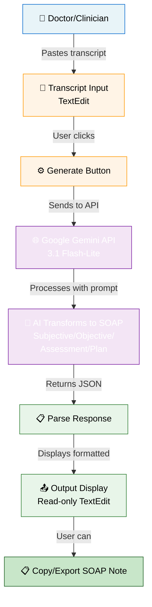
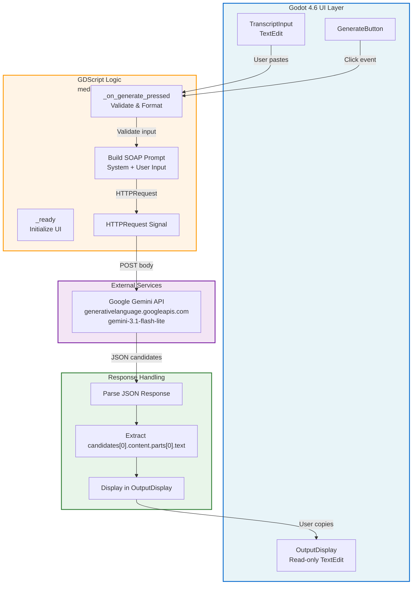

# Medical-Pro

**AI-Powered Clinical Scribe for Godot 4**

A lightweight, specialized medical transcription tool built with **Godot 4.6** that transforms raw patient-doctor dialogues into structured **SOAP notes** (Subjective, Objective, Assessment, Plan) using Google's **Gemini 3.1 Flash-Lite API**.

Perfect for clinics, hospitals, and telemedicine platforms that need instant, professional clinical documentation from voice transcripts.

---

## Features

- ✅ **Real-time AI Processing** — Instant SOAP note generation from raw transcripts
- ✅ **Professional Formatting** — Automatically structures notes into clinical standards
- ✅ **Lightweight & Fast** — Gemini 3.1 Flash-Lite optimized for speed
- ✅ **Standalone Godot App** — No external dependencies, runs on Windows/Mac/Linux
- ✅ **Modular GDScript** — Signal-based architecture for easy extension
- ✅ **Temperature Control** — Configurable AI behavior (0.1 = professional, 1.0 = creative)

---

## Quick Start

### 1. **Clone & Open**
```bash
git clone https://github.com/yourusername/medical-pro.git
# Open in Godot 4.6+
# File → Open Project → select medical-pro folder
```

### 2. **Get a Gemini API Key**
- Go to [Google AI Studio](https://aistudio.google.com/app/apikey)
- Create a new API key
- Copy it

### 3. **Configure & Run**
- Open `medical_pro.gd`
- Find line: `var api_key = "YOUR_KEY_HERE"`
- Paste your key
- Click ▶️ Run Project

**Done!** Paste a transcript, click "Generate SOAP Note", get output.

---

## How It Works



**The process:**

1. **Input** — Clinician pastes raw doctor-patient dialogue
2. **Prompt** — GDScript constructs a system prompt forcing SOAP structure
3. **API Call** — HTTPRequest sends transcript + prompt to Gemini 3.1
4. **Processing** — Gemini extracts clinical data and formats into SOAP sections
5. **Output** — JSON response parsed and displayed as formatted SOAP note
6. **Export** — User copies the note to clipboard or their EHR system

---

## Architecture



---

## Installation

### Requirements
- **Godot 4.6+** ([Download](https://godotengine.org/download/))
- **Internet connection** (for Gemini API)
- **Google Gemini API Key** (free tier available)

### Setup Steps

1. **Clone the repo**
   ```bash
   git clone https://github.com/yourusername/medical-pro.git
   cd medical-pro
   ```

2. **Open in Godot**
   - Launch Godot 4.6
   - File → Open Project
   - Select `medical-pro` folder
   - Click "Open"

3. **Get API Key**
   - Visit [Google AI Studio](https://aistudio.google.com/app/apikey)
   - Click "+ Create API Key"
   - Select your project (or create a new one)
   - Copy the key

4. **Add API Key to project**
   - Open `medical_pro.gd` in the script editor
   - Find line 7: `var api_key = "REDACTED_API_KEY"`
   - Replace with your own key
   - **⚠️ WARNING:** Don't commit this key to GitHub! Use environment variables for production.

5. **Run the project**
   - Click ▶️ at top right
   - Enter a medical transcript in the input field
   - Click "Generate SOAP Note"
   - View formatted output

---

## Usage

### Basic Workflow

**Input example:**
```
Doctor: Good morning, how are you feeling today?
Patient: I've had a persistent dry cough for about 2 weeks. It's worse at night. No fever though.
Doctor: Any shortness of breath?
Patient: A little when climbing stairs, but nothing severe.
Doctor: Let me listen to your lungs...
[continues dialogue...]
```

**Output (SOAP Note):**
```
SUBJECTIVE:
Patient presents with chief complaint of persistent dry cough 
for 2 weeks, worse at night. Denies fever. Reports mild 
dyspnea with exertion (stair climbing). [...]

OBJECTIVE:
Vital signs: BP 120/80, HR 78, RR 16, O2 98% on RA
Physical exam: Lungs clear to auscultation bilaterally [...]

ASSESSMENT:
1. Acute cough, likely viral upper respiratory infection
2. Mild exertional dyspnea - likely secondary to cough [...]

PLAN:
1. Reassurance and supportive care
2. Recommend humidifier, cough suppressants as needed
3. Follow up in 1 week or sooner if symptoms worsen [...]
```

### Configuration

Edit `medical_pro.gd` to customize behavior:

```gdscript
# Line 20: Adjust AI "personality" (lower = more professional)
"temperature": 0.1,  # 0.1 = clinical, 0.7 = conversational

# Line 21: Max response length
"maxOutputTokens": 1000,  # Increase for longer notes

# Line 6: Swap API version
# Current: gemini-3.1-flash-lite
# Alternative: gemini-2.0-flash (faster)
```

---

## API Pricing

**Google Gemini API** (March 2026 rates):
- **Free tier:** 15 requests/minute, unlimited monthly requests
- **Paid:** $0.075 per 1M input tokens, $0.30 per 1M output tokens

A typical medical transcript → SOAP note ≈ 500-1000 tokens = **$0.00003-0.00006 per note**

[Gemini Pricing](https://ai.google.dev/pricing)

---

## Extending Medical-Pro

### Add Custom Sections
Edit the system prompt in `_on_generate_pressed()`:
```gdscript
var system_command = """
TASK: Convert transcript to structured note.
FORMAT: Subjective, Objective, Assessment, Plan, Medications, ReferralNotes.
RULES: Use clinical terminology. Be concise.
"""
```

### Add Export Formats
```gdscript
func export_to_pdf():
    # Use GD.print or file I/O to save output
    var file = FileAccess.open("soap_note.txt", FileAccess.WRITE)
    file.store_string(output_field.text)
```

### Batch Processing
Extend HTTPRequest to handle multiple transcripts in a loop.

### Integration with EHR
Parse output and POST to your EHR API endpoint instead of displaying locally.

---

## Troubleshooting

| Problem | Solution |
|---------|----------|
| "Error: Input is empty" | Paste a transcript first, then click "Generate" |
| "API Error (401)" | Check your API key in `medical_pro.gd` |
| "Empty response from Gemini" | Transcript might be too short/unclear. Try a longer example. |
| "Engine: Processing..." hangs | Check internet connection. Gemini API might be slow. |
| Godot won't open project | Ensure you're using Godot 4.6+. Download from [godotengine.org](https://godotengine.org) |

---

## Security & Best Practices

⚠️ **Never commit your API key to GitHub!**

Instead, use environment variables:

```gdscript
# medical_pro.gd (revised)
var api_key = OS.get_environment("GEMINI_API_KEY")

if api_key.is_empty():
    output_field.text = "Error: Set GEMINI_API_KEY environment variable"
    return
```

Before running:
```bash
# macOS/Linux
export GEMINI_API_KEY="your_key_here"
godot

# Windows (PowerShell)
$env:GEMINI_API_KEY="your_key_here"
godot
```

---

## Tech Stack

| Component | Details |
|-----------|---------|
| **Engine** | Godot 4.6 |
| **Language** | GDScript |
| **AI/ML** | Google Gemini 3.1 Flash-Lite API |
| **HTTP** | Built-in HTTPRequest node |
| **UI Framework** | Godot Scene System (Nodes) |
| **Version Control** | Git / GitHub |

---

## Roadmap

- [ ] Batch transcript processing
- [ ] PDF export with formatting
- [ ] EHR system integrations (Epic, Cerner)
- [ ] Voice-to-text input (streaming)
- [ ] Custom SOAP templates per specialty
- [ ] Local caching of generated notes
- [ ] Web version (Godot HTML5 export)

---

## Contributing

1. Fork the repo
2. Create a feature branch (`git checkout -b feature/your-feature`)
3. Commit your changes (`git commit -am 'Add feature'`)
4. Push to the branch (`git push origin feature/your-feature`)
5. Open a Pull Request

---

## License

MIT License — see [LICENSE](LICENSE) file.

**Medical-Pro is a tool for documentation assistance. Always verify AI-generated clinical notes with qualified healthcare professionals before use.**

---

## Support

- **Issues & Bugs:** [GitHub Issues](https://github.com/yourusername/medical-pro/issues)
- **Questions:** Discussions tab or email
- **Godot Docs:** [docs.godotengine.org](https://docs.godotengine.org)
- **Gemini API Docs:** [ai.google.dev](https://ai.google.dev/docs)

---

Made with ❤️ for clinicians, by developers. **Medical-Pro v1.0.0** (March 2026)